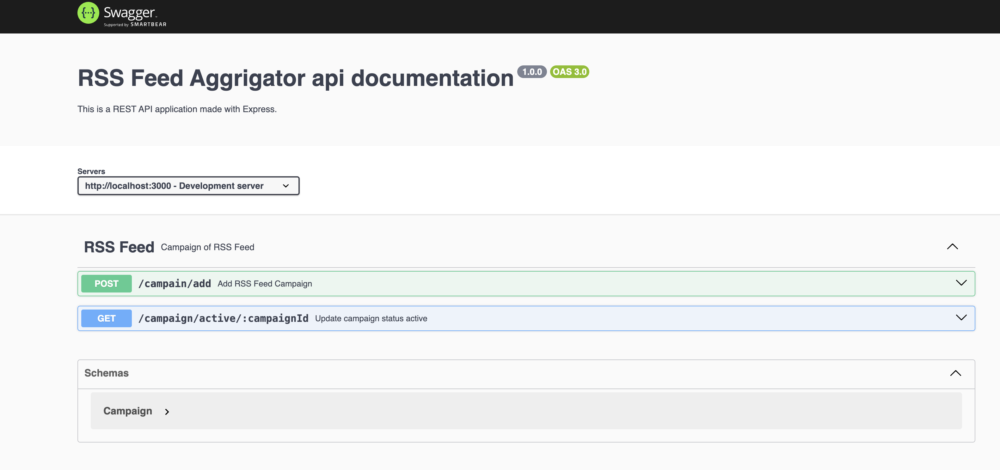

# Scalable RSS Feed Aggrigator

## System Architecture Diagram


---

## Project Description

I try to create a very simple but highly scalable Rss Feed Aggrigator. It will accept RSS feed content as campaign then there is a scheduler which will run every 5 mins interval.
Scheduler will process every RSS feed and save all the articles into DB.

Feed crawling task is fully idempotent operation. For the topic selection part I didn't use any LLM. I just extract all keywords from the content, find out which one is max use then make that a topic.

Article insertion has a format you can check in app_settings.
Right now I expose 2 api one for creating campaigns and another one is an active campaign. After active campaign scheduler will run that campaign

## Installation

#### Step 1:

Clone the repository by running the following command:

```bash
git clone https://github.com/AtiqulHaque/rss-feed-crawler
cd rss-feed-crawler
```

#### Step 2:

Copy the environment file then update the env values accordingly:

```bash
cp config.env .env
```

#### Step 3:

Run container with required dependencies:

```bash
make up
```

#### Step 4:

Seed the the database:

```bash
make seed
```

Application will be started and available at http://localhost:3300/api/ping

## Folder Structure

```text
├── Dockerfile
├── Makefile
├── README.md
├── api-docs.png
├── architecture_diagram.png
├── config.env
├── cron
│   ├── index.js
│   ├── jobs
│   │   ├── campaign_parser.js
│   │   └── ping.js
│   ├── jobs.js
│   └── utils.js
├── database
│   ├── bootstrap.js
│   ├── models
│   │   ├── ArticleModel.js
│   │   ├── CampaignModel.js
│   │   └── CampaignRunningHistoryModel.js
│   └── repositories
│       ├── ArticleRepository.js
│       ├── CampaignHistoryRepository.js
│       └── CampaignRepository.js
├── docker-compose.yml
├── ecosystem.config.js
├── index.js
├── middlewares
│   └── rateLimiter.js
├── newrelic_agent.log
├── package-lock.json
├── package.json
├── postman
│   ├── FILE_SHARE_SERVICE_DEV.postman_environment.json
│   └── File Sharing API.postman_collection.json
├── services
│   ├── ArticleService.js
│   ├── CampaignHistoryService.js
│   ├── CampaignService.js
│   ├── FeedParserService.js
│   ├── FileDeleteService.js
│   └── TopicExtractorService.js
├── settings
│   └── app.js
├── test
│   ├── index.spec.js
│   └── test.png
├── utilities
│   ├── CacheHandler.js
│   ├── apiFeatures.js
│   ├── appError.js
│   ├── base62Encoder.js
│   ├── bullmq.js
│   ├── filterText.js
│   ├── logger.js
│   ├── math.js
│   ├── network.js
│   ├── newrelic.js
│   ├── redis.js
│   ├── response.js
│   ├── scoreSettings.json
│   └── sentry.js
├── web
│   ├── controllers
│   │   ├── FileProcessController.js
│   │   ├── WelcomeController.js
│   │   └── tasks.js
│   ├── docs
│   │   └── docs.js
│   ├── index.js
│   ├── routers
│   │   ├── FileProcessRouter.js
│   │   └── tasks.js
│   └── validators
│       └── FileDeleteValidators.js
└── workers
    ├── config.js
    ├── handlers
    │   ├── article_parser.js
    │   ├── feed_parser.js
    │   └── ping.js
    └── index.js

```

### 1. `postman`

-   This directory typically contains Postman Collection

## API Specification



---
